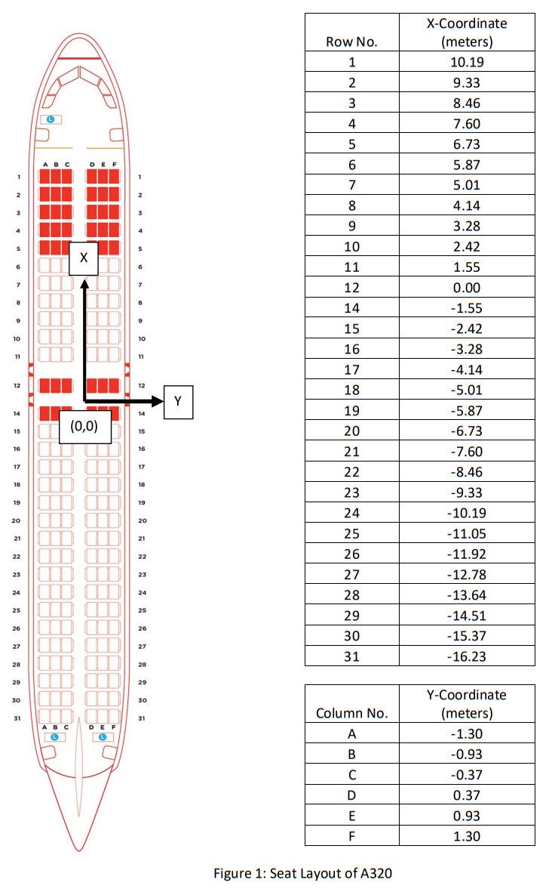
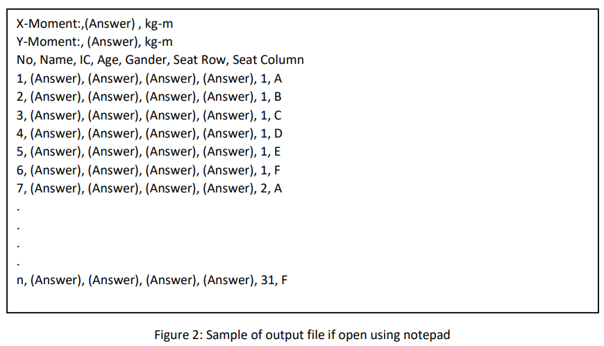
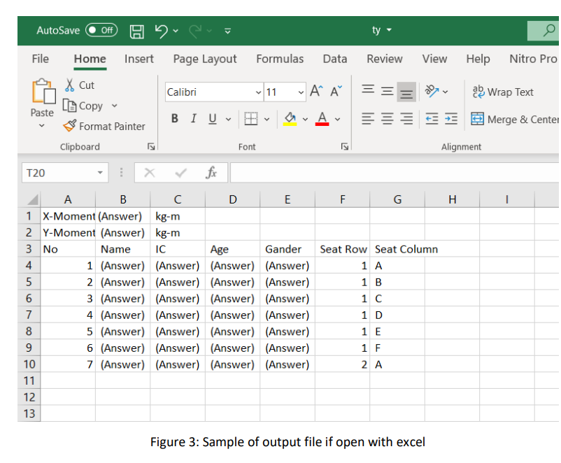

## This file provides a detailed description of the tasks given that lead to the creation of this C program.

Assume that you are an engineer for AirFlyer, a low-cost airline operates in South East Asian county. You are ordered by your manager to develop a simple program to assign the seat for passengers who do not pay extra for seat reservation. As an initial try, you are given the flight model A320 where the principle parameter for the flight model as in Table 1. 

**Table 1: Dimension of A320 Aircraft**
|       Name      |                Particular               |
|:---------------:|:---------------------------------------:|
|       Type      |                   A321                  |
|      Length     |               44.51 metres              |
|     Wingspan    | 34.10 metres with Sharklets 35.8 metres |
|   Tail Height   |               11.76 metres              |
|  Fuselage Width |               3.95 metres               |
|   Cabin Width   |               3.70 metres               |
| Fuselage Height |               4.14 metres               |

At the condition ready to take off, assume the mass of the flight without passenger is 62,500 kG and the center of gravity from the zero offset is located at X=0 meters and Y=0 meter. Besides, the seat layout of the flight and the coordinate of the seat as is shown in [[Figure 1](#figure1)]. The mass of each passenger is estimated according to the gender and age as shown in Table 2:

**Table 2: Body Weight for Different Age Groups**
|      Age     |                 Male                 |                Female                |
|:------------:|:------------------------------------:|:------------------------------------:|
|    Below 5   |                  15                  |                  15                  |
|    5 to 20   | 0.0612(age)^2 + 1.4512(age) + 5.0362 | 0.0612(age)^2 + 1.4512(age) + 5.0362 |
|   21 to 25   |                  58                  |                  53                  |
|   26 to 30   |                  65                  |                  54                  |
|   31 to 60   |                  70                  |                  58                  |
| 61 and above |                  65                  |                  55                  |

As the programmer, your target is to build an automatic seat assign program where help in minimize the moment in both x-axis and y-axis toward the center point. The input file for passengers with paid seat reservation is named as “WithReserve.dat” and the input file for passenger without doing seat reservation is named as “NoReserve.dat”. Your program should able to generate an output with the file name “PassengerList.csv” and the format of output file as shown in [[Figure 2](#figure2)] and [[Figure 3](#figure3)].

 

 

 
